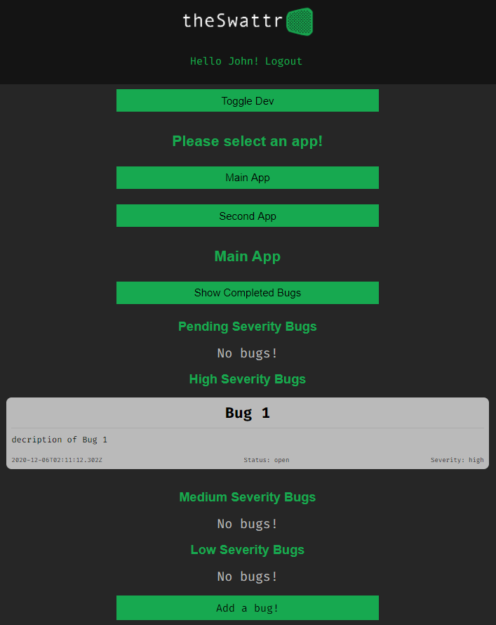
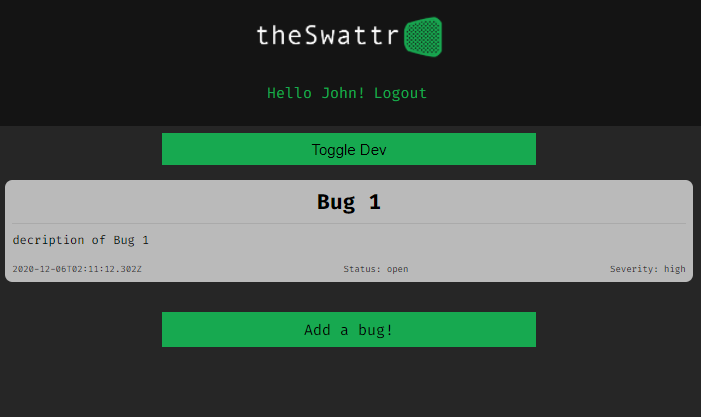
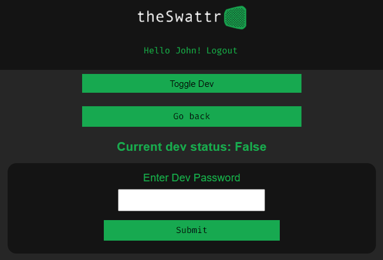
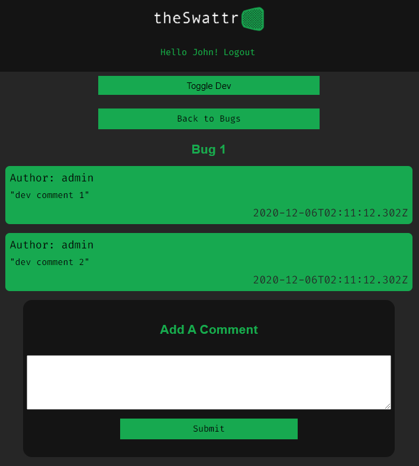
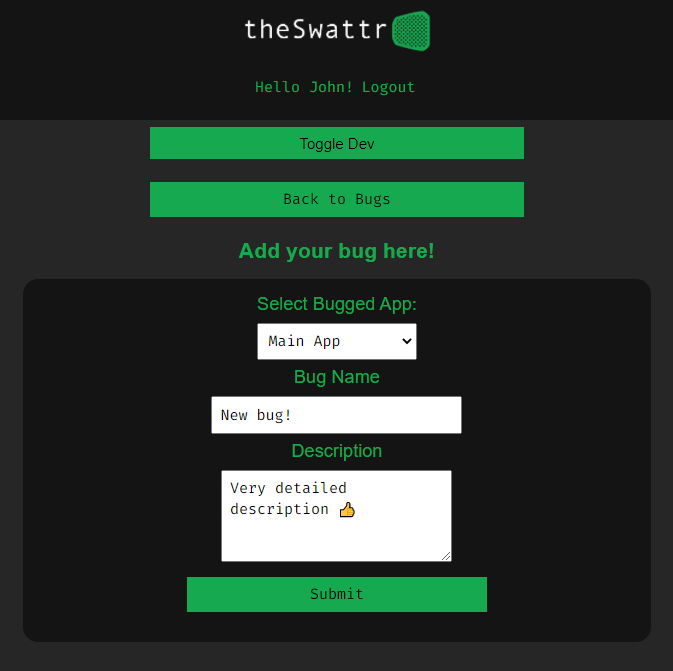
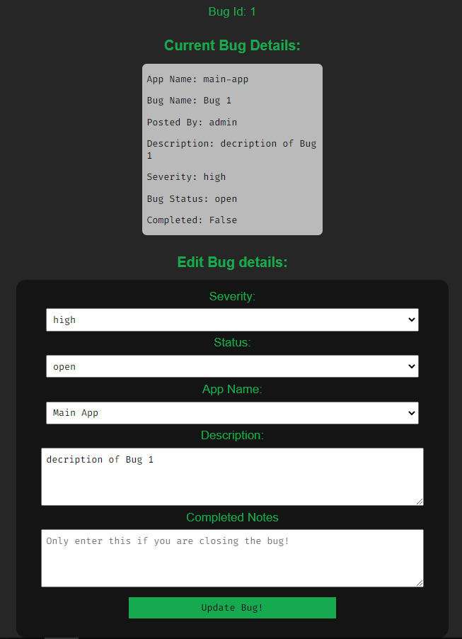

<!--
*** I'm using markdown "reference style" links for readability.
*** https://www.markdownguide.org/basic-syntax/#reference-style-links
-->

<!-- ! highlight and 'ctrl+shift+L' to replace all ! -->

<!-- thinkful-ei-rabbit -->
<!-- Cap3_Client_Team_A -->
<!-- theSwattr -->
<!-- React, Node.js, Postgresql -->
<!-- https://cap3-client-team-a.vercel.app/login -->

<!-- ! highlight and 'ctrl+shift+L' to replace all ! -->

[![Contributors][contributors-shield]][contributors-url]
[![Forks][forks-shield]][forks-url]
[![Stargazers][stars-shield]][stars-url]
[![Issues][issues-shield]][issues-url]
[![MIT License][license-shield]][license-url]
[![LinkedIn][linkedin-shield]][linkedin-url]

<!-- PROJECT LOGO -->
<br />
<p align="center">
  <a href="https://github.com/thinkful-ei-rabbit/Cap3_Client_Team_A">
    
  </a>

  <h3 align="center">theSwattr - Client</h3>

  <p align="center">
    React, Node.js, Postgresql
    <br />
    <a href="https://github.com/thinkful-ei-rabbit/Cap3_Client_Team_A"><strong>Explore the docs »</strong></a>
    <br />
    <br />
    <a href="https://github.com/thinkful-ei-rabbit/Cap3_Client_Team_A/issues">Report Bug</a>
    ·
    <a href="https://github.com/thinkful-ei-rabbit/Cap3_Client_Team_A/issues">Request Feature?</a>
  </p>
</p>

---

<div align="center">
  <h1><a href="https://the-swattr.vercel.app">Bug Tracker App</a></h1>
  <p>Click the title to go to the live app!</p>
  <h3>Demo Credentials:</h3>
  <div><strong>Username:</strong> admin</div>
  <div><strong>Password:</strong> pass</div>
</div>

---

###### This README will systematically go over the entire app from the top level to the bottom layer, so I'll provide links to various sections for convenience.

# TODO - ADD DIRECTORY LINKS!

---

## What's this app for!?

This app is for tracking bugs in your app, offering an API for both users and developers to submit bugs and then follow-up with a kind of message board on a bug-by-bug basis. I'll quickly go over the basic functions of the client - with pictures!

<div align="center">
  <h5>Main Dashboard for devs...</h5>
  
  <h5>...and for users.</h5>
  
</div>

* The main take-away here is that devs can see all bugs, while regular users can only see bugs they submitted themselves. That's the basic for the difference between user and developer views throughout the app.

##### Clicking on the _Toggle Dev_ button will take you to...

<div align="center">
  <h5>Toggle Dev Page</h5>
  
</div>

* Here you can see your current dev status, and enter a secret to toggle it on (or off!). The current secret code is **`irdev`**

##### Clicking on a bug will take you to...

<div align="center">
  <h5>Comments Page</h5>
  
</div>

* Here you can view all comments for the selected bug ordered by date, and create a new comment when desired.

##### Clicking _Add Bug_ takes you to...

<div align="center">
  <h5>Add Bug Page</h5>
  
</div>

* Here you can add a new bug, with a default status and severity set to pending, later to be updated by a dev.


##### Lastly, as a dev, there's an extra button above the comments when viewing a bug. Clicking the _Edit Bug_ button leads to...

<div align="center">
  <h5>Edit Bug Page</h5>
  
</div>

* Devs can set status and severity here, along with some other parameters if the bug was submitted incorrectly.

---

## public

The Public folder is nothing special, besides the custom favicon and (as I'll note later) some imported CDNs in the head of index.html for a few Google Fonts.

_As an aside, it's actually faster (from a runtime perspective) to import fonts via CDNs, as apposed to importing them directly into stylesheets_

---

# src:

## config.js, index.js, and setupTests.js

**[ config.js ]** - this is essentially where I store "environment" variables. One important thing to know is that React has a built-in `NODE_ENV` variable that is set automatically when running scripts:

1. Run **Start**: `NODE_ENV = developement`
1. Run **Build**: `NODE_ENV = production`
   > Knowing this, you can take advantage and set up conditionals based on the already-available `NODE_ENV`. A major advantage is setting up API urls. When exporting like this...
   >
   > ```js
   > export default { ...config };
   > ```
   >
   > ... you can access variables like this...
   >
   > ```js
   > import config from '.../config.js';
   > ...
   >   await fetch(config.API_ENDPOINT)
   > ```
   >
   > **[ index.js ]** - bog-standard React App-wrapper using BrowserRouter
   > **[ setupTests.js ]** - configuration for Enzyme testing

---

## styles:

Fairly straight-forward Sass setup, with a simple reset and global stylesheet imported into the root index file. I won't get into Sass here, but know that I broke-out individual mixins to be used as imports in isolated **[ .scss ]** files

---

###### _I'll briefly cover some global-level stuff before breaking down the App itself_

### jsconfig.json:

This is at the root level, but it's use is important in understanding the syntax used throughout the app. I won't go too in-depth, but essentially what's going on is it's creating a global alias for the **[ src/ ]** file directory. The side effect is that you can re-factor local imports:

```js
/* deeplyNestedComponent.js */
import { PostService } from '../../../../../src/services';
...to...
import { PostService } from 'src/services';
```

For more info on the `jsconfig.json`, check out the docs [_*HERE!*_][jsconfig-docs]

### constants:

Not strictly necessary, but this can help prevent typos, along with making changes to the database less tedious to update throughout the app.

### services:

This is where the logic for interfacing with the server lives. Each "method" has been broken-out into it's own file. [ token.service.js ] is for handling Auth-token processes.

One exception in the `token.service.js` file, where all the interfacing with `window.localStorage` is handled. The other is `idle.service.js`, which determins the JWT expiration and regularly refreshes the stored `authToken`.

### hooks:

This is where I keep custom hooks used by multiple components, though only 1 was needed. This hook handles every form in the app, recieving and updating piped-in form-fields. The major benefit of this kind of hook is that it minimizes the use of `useState` hooks throughout the app and normalizes form handling.

# TODO!!!

### context:

This is the "hook" way of doing context, both creating the context...

```js
export const DatabaseContext = createContext();
```

...and provider...

```js
<DatabaseContext.Provider value={value}>
  {props.children}
</DatabaseContext.Provider>
```

...in the same file. To use, you import the provider at the top level...

```js
import DatabaseContextProvider from '.../databaseContext';
...
<DatabaseContextProvider>
  (...insert components here!)
</DatabaseContextProvider>
```

...then invoke inside a component and _just use it_:

```js
import { useContext } from 'react';
import { DatabaseContext } from '.../databaseContext';
...
const { data, functions, andMore } = useContext(DatabaseContext);
```

### Barrels...

You may have already noticed that there are actually many [ index.js ] files peppered throughout the app. These are known as "barrel" exports, and have a few advantages when dealing with a complex file-directory. The index file in the [ components ] folder has a short explanation, but I'll also put it here:

```js
/*
|------------------------------------------------------
| BARREL EXPORT FILE
|------------------------------------------------------
| How-To barrel-export components:
| export { default as Comp1 } from './comp1/comp1.js' (omit .js)
|
| Why? Readability and (to an extent) testing:
| import { Comp1, Comp2, Comp3, Comp4 } from './components'
| import { Route1, Route2, Route3, Route4 } from './routes'
*/
export { default as LoginForm } from './loginForm/loginForm'
export { default as Header } from './header/header'
etc...
```

You can see this in action in **[ app.js ]**:

```js
import {
  HomeRoute,
  DashboardRoute,
  LoginRoute,
  RegisterRoute,
  PrivateRoute,
  PublicRoute,
} from 'src/routes';
```

> _Note that the import doesn't point to the index file. Node perceives **[ index.js ]** files as points of entry and the default file to grab exports from, essentially making it an implicit file in import statements_

---

## app:

Nothing much to say. This is a basic point-of-entry using React-Router. The switch at the top level acts as a router for pointing those logged in/out to the right destination.

---

## routes:

These essentially just import and render components, acting as entry points to component trees. However, I'll briefly cover...

#### utils:

**Private/Public-Routes**: This serves as a UX enhancement, both preventing users not logged in from accessing the app, and already logged in users from accessing the Login page.

<!-- **1. PageNotFound**: Standard inclusion, and in the case of this version, you can access this page vie the "Gigs" page as this is a feature not yet implemented. -->

---

## components:

###### _I won't cover every component individually, but take a more broad-stroke approach, mentioning any note-worthy features when necessary_

### mainContaner:

This acts like a new "root" component, much like the App component. There's some basic state handling at the top level, and another switch that takes care of the app proper, with the various extra context providers taking care of dynamic database operations.

### a note on forms:

This file - `src/helpers/formFields.js` - is the main "constructor" for rendering forms throughout the app. Each export contains some schema data and a single method that uses the schema data and any necessary state/handlers passed in to return an array of labels and inputs. Mainly, this keeps the component files much, much leaner and easier to read!

<!-- ##### utils: -->

---

## <!-- CONTACT -->

## Contact Derek:

#### Github - [musicMan1337][github]

#### LinkedIn - [Derek-8Bit-Nellis][linkedin]

#### Facebook - [Derek Nellis][facebook]

#### Instagram - [@derek.8bit.nellis][instagram]

## Contact Mark:

#### Github - [Mark-The-Dev](https://github.com/Mark-The-Dev)

#### LinkedIn - [Mark Marcello](https://www.linkedin.com/in/mark-marcello/)

## Contact Russell:

#### Github - [Russjames92](https://github.com/Russjames92)

<<<<<<< HEAD

#### Github -

#### LinkedIn -

=======

#### LinkedIn - [Russell Champlain](https://www.linkedin.com/in/russell-champlain/)

> > > > > > > a1e4c43fd25ec404b1e62a7569897a2b53e67f66

<!-- MARKDOWN LINKS & IMAGES -->

<!-- https://www.markdownguide.org/basic-syntax/#reference-style-links -->

[contributors-shield]: https://img.shields.io/github/contributors/thinkful-ei-rabbit/Cap3_Client_Team_A.svg?style=flat-square
[contributors-url]: https://github.com/thinkful-ei-rabbit/Cap3_Client_Team_A/graphs/contributors
[forks-shield]: https://img.shields.io/github/forks/thinkful-ei-rabbit/Cap3_Client_Team_A.svg?style=flat-square
[forks-url]: https://github.com/thinkful-ei-rabbit/Cap3_Client_Team_A/network/members
[stars-shield]: https://img.shields.io/github/stars/thinkful-ei-rabbit/Cap3_Client_Team_A.svg?style=flat-square
[stars-url]: https://github.com/thinkful-ei-rabbit/Cap3_Client_Team_A/stargazers
[issues-shield]: https://img.shields.io/github/issues/thinkful-ei-rabbit/Cap3_Client_Team_A.svg?style=flat-square
[issues-url]: https://github.com/thinkful-ei-rabbit/Cap3_Client_Team_A/issues
[license-shield]: https://img.shields.io/github/license/thinkful-ei-rabbit/Cap3_Client_Team_A.svg?style=flat-square
[license-url]: https://github.com/thinkful-ei-rabbit/Cap3_Client_Team_A/blob/master/LICENSE.txt
[linkedin-shield]: https://img.shields.io/badge/-LinkedIn-black.svg?style=flat-square&logo=linkedin&colorB=555
[linkedin-url]: www.linkedin.com/in/derek-8bit-nellis
[jsconfig-docs]: https://code.visualstudio.com/docs/languages/jsconfig

<!-- project links -->

<!-- links to social media accounts -->

[twitter]: http://www.twitter.com/userName
[facebook]: http://www.facebook.com/derek.nellis.9
[googleplus]: https://plus.google.com/+userName
[tumblr]: http://userName.tumblr.com
[dribble]: http://dribbble.com/userName
[linkedin]: https://www.linkedin.com/in/derek-8bit-nellis/
[github]: http://www.github.com/musicMan1337
[instagram]: https://www.instagram.com/derek.8bit.nellis/?hl=en
